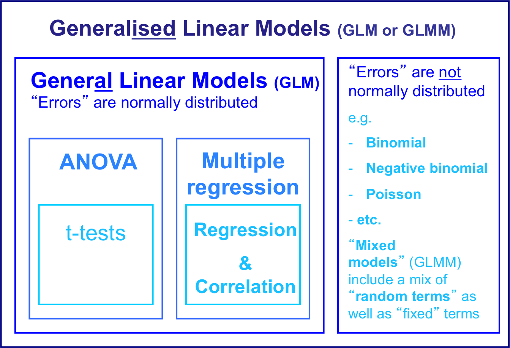

Etherpad:

https://public.etherpad-mozilla.org/p/404GLMs

---

## What is a frequency distribution? {#freq .center}

## What frequency distributions can you remember? {#freq .center}

---

# Frequency Distributions

```{r, echo = FALSE}

par(mfrow = c(2,2))
normal <- rnorm(1000)
hist(normal, main = 'Normal', xlab = NULL)

binom <- rbinom(1000, 1, 0.3)
hist(binom, main = 'Binomial', xlab = NULL)

pois <- rpois(1000, 2)
hist(pois, breaks = 9, main = 'Poisson', xlab = NULL)

negbim <- rnbinom(500, mu = 4, size = 1)
hist(negbim, breaks = 20, main = 'Negative Binomial', xlab = NULL)

```

---

# Why do we care? {#care .center}


Relative species abundance of beetles sampled from the river Thames collected by C.B. Williams (1964). (Magurran 2004)

---

# Learning Objectives

- compare and categorize GLMs vs ANOVAS and regressions
- Run a model using GLMs
- Identify and know how to use the different components of GLMs
- How to choose a good model

---



---

# When do we use them?

Used when the residuals from a General Linear Model are not-normal and/or there are non-linear relationships between dependent & independent variables

Whilst it is the error distribution (the residuals) that is important, the distribution of the dependent variable has a strong influence on this.

---

# General formula {#formula .center}

$y = g(\beta_{0} + \beta_{1}X_{1} + \beta_{2}X_{2} + ... + \beta_{i}X_{i}) + \varepsilon$

$X$ is your explanatory variable 

$y$ your response variable 

$\beta$ is the coefficient

$\varepsilon$ is the error term


Where $g$ is a function (called the link function) which transforms each value of y in relation to the linear predictors (the variables and their coefficients)
i.e. the link function transforms the dependent variable within the model.

---

# What is the link function?

Link Functions: defining the shape of the relationship between the dependent & independent variables.

```{r, echo = FALSE}
par(mfrow = c(1,1))
x <- 1:100
p <- seq(0, 1, 0.01)
Power <- x^3
Logarithm <- log(x)
loglog <- log(p/(1-p))
negbimdis <- dnbinom(x, 3, 0.2)

par(mar=c(5.1, 4.1, 4.1, 13.1), xpd=TRUE)
plot(x, x, type = 'l', lwd = 3, ylab = '', xlab = '', xaxt='n', yaxt='n', bty='L')
par(new=TRUE)
plot(x, negbimdis, type = 'l', lwd = 3, col = 'red', ylab = '', xlab = '', xaxt='n', yaxt='n')
par(new=TRUE)
plot(loglog, p, type = 'l', lwd = 3, col = 'blue', ylab = '', xlab = '', xaxt='n', yaxt='n')
par(new=TRUE)
plot(x, Power, type = 'l', lwd = 3, col = 'green', ylab = '', xlab = '', xaxt='n', yaxt='n')
par(new=TRUE)
plot(x, Logarithm, type = 'l', lwd = 3, col = 'purple', ylab = '', xlab = '', xaxt='n', yaxt='n')
legend(x = 'topright', inset=c(-0.53,0), legend = c('Identity', 'Negative Binomial', 'Complementary log-log', 'Power', 'Logarithm'), col = c('black', 'red', 'blue', 'green', 'purple'), lwd = 3)

```


Using a link function is often better than simply transforming the dependent variable, because it doesn’t simply attempt to make the variance constant. Instead, it fits a function that “adjusts” the variance as the data is being fitted.
---
# What links should I use?

Families             | Links 
---------            |--------
gaussian (c)         | identity, log, inverse
inverse.gaussian (c) |$1/\mu^2$, inverse, identity, log
gamma (c)            |inverse, identity, log
quasi (c)            |logit, probit, cloglog, identity, inverse, $1/\mu^2$, sqrt, power
poisson (d)          |log, identity, sqrt
quasipoisson (d)     |identity, logit, probit cloglog
negative binomial (d)|log, sqrt, identity    *use glm.nb function from MASS library*
binomial (d)         |logit, probit, cauchit, log, cloglog
quasibinomial (d)    |identity, logit, probit, cloglog

 d = discrete, c = continous
 
---

# So many options... How do I choose?

Start with the default link function for the family error term that you have chosen. E.g. for family = binomial, the “logit” is the default link function.

The “correct” combination of family and link function is arrived at by trial and error, comparing 

- residual distributions (aiming for normal) 
- adjusted R2 values (where relevant, higher is better)
- AIC values (lower is better) of different nested models

---

# Challenge 


---

# How do I do it in R?

```{r}
Owl <- read.csv('Owl.csv')
head(Owl)
hist(Owl$count)
```

