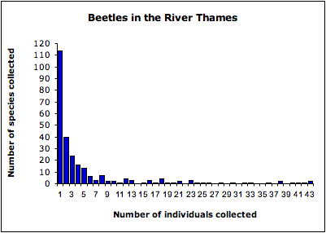
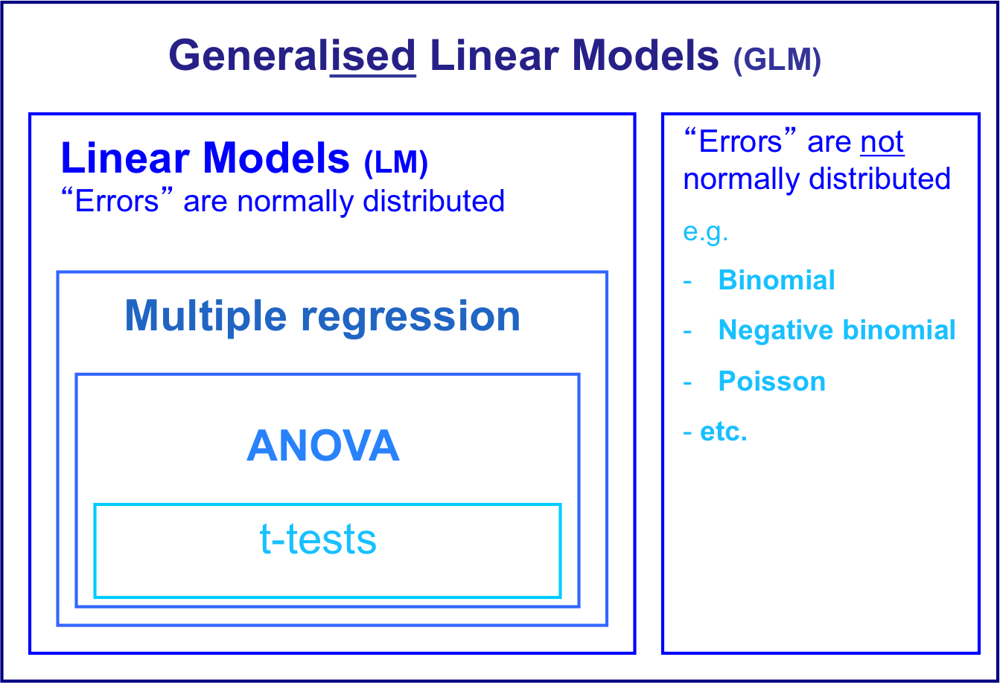
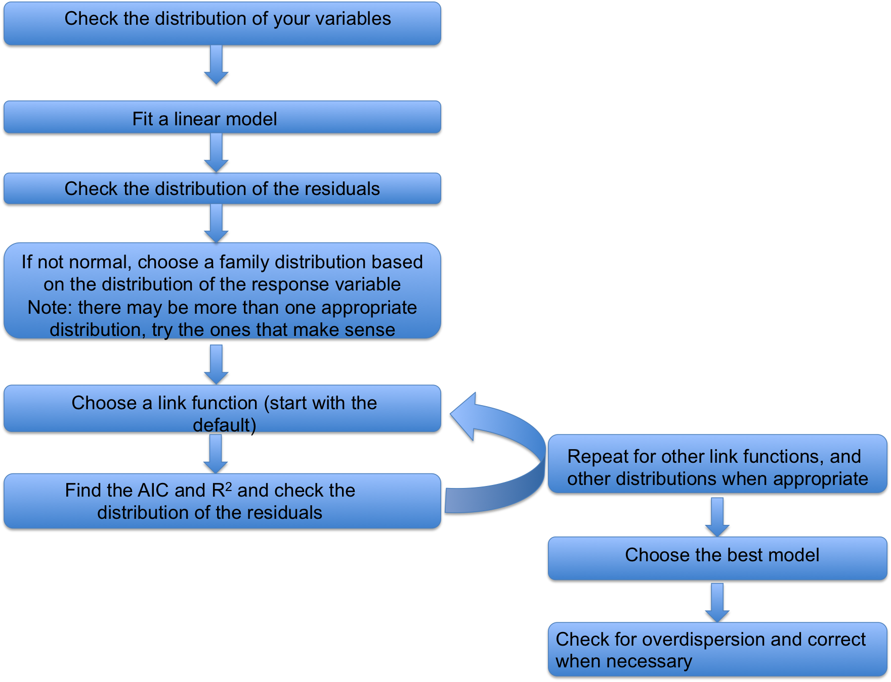

Etherpad:

https://public.etherpad-mozilla.org/p/404GLMs


Link to all material:

https://github.com/lmguzman/GLMs

---

## What is a frequency distribution? {#freq .center}

## What frequency distributions can you remember? {#freq .center}

---

# Frequency Distributions

```{r, echo = FALSE}

par(mfrow = c(2,2))
normal <- rnorm(1000)
hist(normal, main = 'Normal', xlab = NULL)

binom <- rbinom(1000, 1, 0.3)
hist(binom, main = 'Binomial', xlab = NULL)

pois <- rpois(1000, 2)
hist(pois, breaks = 9, main = 'Poisson', xlab = NULL)

negbim <- rnbinom(500, mu = 4, size = 1)
hist(negbim, breaks = 20, main = 'Negative Binomial', xlab = NULL)

```

---

# Why do we care? {#care .center}



Relative species abundance of beetles sampled from the river Thames collected by C.B. Williams (1964). (Magurran 2004)

---

# Learning Objectives

By the end of this lesson the students will:

- Differentiate and categorize GLMs vs ANOVAS and regressions
- Identify the different components of GLMs
- Select the most appropriate GLM
- Carry out a GLM

---



LO: Differentiate and categorize GLMs vs ANOVAS and regressions {.smaller}
---

# When do we use them?

Used when the *residuals* from a linear model are not-normal 

Whilst it is the error distribution (the residuals) that is important, the distribution of the dependent variable has a strong influence on this.

---

# General formula {#formula .center}

$y = g(\beta_{0} + \beta_{1}X_{1} + \beta_{2}X_{2} + ... + \beta_{i}X_{i}) + \varepsilon$

$X$ are your explanatory variables 

$y$ your response variable 

$\beta$ are the coefficients

$\varepsilon$ is the error term


Where $g$ is a function (called the link function) which transforms each value of y in relation to the linear predictors (the variables and their coefficients)
i.e. the link function transforms the dependent variable within the model.

LO: Identify the different components of GLMs {.smaller}
---

# What is the link function?

Link Functions: defining the shape of the relationship between the dependent & independent variables.
```{r, echo = FALSE}
par(mfrow = c(1,1))
x <- 1:100
p <- seq(0, 1, 0.01)
Power <- x^3
Logarithm <- log(x)
loglog <- log(p/(1-p))
negbimdis <- dnbinom(x, 3, 0.2)

par(mar=c(5.1, 4.1, 4.1, 13.1), xpd=TRUE)
plot(x, x, type = 'l', lwd = 3, ylab = '', xlab = '', xaxt='n', yaxt='n', bty='L')
par(new=TRUE)
plot(x, negbimdis, type = 'l', lwd = 3, col = 'red', ylab = '', xlab = '', xaxt='n', yaxt='n')
par(new=TRUE)
plot(loglog, p, type = 'l', lwd = 3, col = 'blue', ylab = '', xlab = '', xaxt='n', yaxt='n')
par(new=TRUE)
plot(x, Power, type = 'l', lwd = 3, col = 'green', ylab = '', xlab = '', xaxt='n', yaxt='n')
par(new=TRUE)
plot(x, Logarithm, type = 'l', lwd = 3, col = 'purple', ylab = '', xlab = '', xaxt='n', yaxt='n')
legend(x = 'topright', inset=c(-0.53,0), legend = c('Identity', 'Negative Binomial', 'Complementary log-log', 'Power', 'Logarithm'), col = c('black', 'red', 'blue', 'green', 'purple'), lwd = 3)

```

---

#Why use a link function instead of transforming the data?
```{r, echo = FALSE, warning = FALSE}
x <- runif(100, 0, 10)
y <- exp(x) + rnorm(length(x), mean = 0, sd = 100)
par(mfrow = c(1,2))
plot(x, y, pch = 16, main = 'Original data')
plot(x, log(y), main = 'Log transformed')
```

---

#Let's fit some models to that data

```{r, warning = FALSE}
model1 <- lm(log(y)~x)
model2 <- glm(y~x, family = gaussian (link = "log"), start=c(1, 1))
```

```{r, echo = FALSE, warning = FALSE}
par(mfrow = c(1,2))

plot(x, log(y), main = 'LM')
fitedx <- x[as.numeric(names(model1$fitted.values))]
points(fitedx, model1$fitted.values, col = 'red')
legend(x = 'topleft', legend = c('Original values','Fitted values'), pch = c(16, 1), col = c('black','red'))

plot(x, y, pch = 16, main = 'GLM')
points(x, model2$fitted.values, col = 'red')
legend(x = 'topleft', legend = c('Original values','Fitted values'), pch = c(16, 1), col = c('black','red'))
```

Using a link function is often better than simply transforming the dependent variable, because it doesn’t simply attempt to make the variance constant. Instead, it fits a function that “adjusts” the variance as the data is being fitted.

---

# What links should I use? 

Families                   |Links
---------|----------------
gaussian (c)               |identity, log, inverse             
inverse.gaussian (c)       |$1/\mu^2$, inverse, identity, log
gamma (c)            |inverse, identity, log
quasi (c)            |logit, probit, cloglog, identity, inverse, $1/\mu^2$, sqrt, power
poisson (d)          |log, identity, sqrt
quasipoisson (d)     |identity, logit, probit cloglog                                    
negative binomial (d)|log, sqrt, identity    *use glm.nb function from MASS library*    
binomial (d)         |logit, probit, cauchit, log, cloglog                               
quasibinomial (d)    |identity, logit, probit, cloglog                                   

 d = discrete, c = continous
 
 First link is the default
 
---

# So many options... How do I choose?

Start with the default link function for the family error term that you have chosen. E.g. for family = binomial, the “logit” is the default link function.

The “correct” combination of family and link function is arrived at by trial and error, comparing 

- residual distributions (aiming for normal) 
- adjusted R2 values (where relevant, higher is better)
- AIC values (lower is better) of different nested models


LO: Select the most appropriate GLM {.smaller}
---

# Challenge 

```{r, echo = FALSE, message = FALSE}

ClassData <- read.csv('Data/ClassData.csv')

library(dplyr)
ClassData <- ClassData %>% 
  mutate(Sex = ifelse(What.is.your.sex. == 'Female', 1, 0)) %>%
  mutate(Sex = as.numeric(Sex))
```


```{r, echo = FALSE}
par(mfrow = c(3, 2))
hist(ClassData$How.old.are.you., xlab = '', main = 'How old are you?')
hist(ClassData$How.many.siblings.do.you.have., xlab = '', main = 'How many siblings do you have?')
hist(ClassData$How.tall.are.you..in.cm , xlab = '', main = 'How tall are you?')
hist(ClassData$Sex, xlab = '', main = 'What is your sex?')
hist(ClassData$Out.of.the.7.nights.of.the.week..how.many.do.you.sleep.at.least.6.hours./7, xlab = '', main = 'How many nights a week do you sleep at least 6 hours')

```

What type of distribution are these?

Can you think of other types of data with the same distribution?

What family and link functions would you use?


---

# How do I do it in R?

Let's look at some data first. 

```{r}
Lizards <- read.csv('Data/lizards.txt', sep = "\t")
head(Lizards)
```

LO: Carry out a GLM {.smaller}
---

---
```{r}
hist(Lizards$n)
```

---

```{r}
LizardsModelLM <- lm(n ~ sun + height + species, data = Lizards)

LizardsModel <- glm(n ~ sun + height + species, family = poisson (link = log), data = Lizards)
```

---

#Check assumptions of the model

1. Distribution of the residuals

```{r}
par(mfrow = c(2,2))
plot(LizardsModelLM)
```

---

#Let's see the GLM

```{r}
par(mfrow = c(2,2))
plot(LizardsModel)
```


---

2. Overdispersion

In a poisson distribution, mean = variance

Overdispersion parameter $\theta$ = $\frac{ \text{residual deviance}}{\text{residual degrees of freedom}}$

```{r}
LizardsModel$deviance / LizardsModel$df.residual
```

If your model is overdispersed use the *quasi* family. In this case, quasipoisson

---

#pseudo $R^2$ explained deviance

Pseudo $R^2$ = $\frac{\text{null deviance} - \text{residual deviance}}{\text{null deviance}}$

```{r}
(LizardsModel$null.deviance - LizardsModel$deviance) / LizardsModel$null.deviance
```

---

#Model Summary

```{r}

summary(LizardsModel)

```

---

#Challenge 

Using the Boar csv, run the appropriate GLM.

Make sure you check the model assumptions and all appropriate link functions

---

# Learning Objectives

By the end of this lesson the students will:

- Differentiate and categorize GLMs vs ANOVAS and regressions
- Identify the different components of GLMs
- Select the most appropriate GLM
- Carry out a GLM

---

#Summary 



---

#Challenge 2 Solution

Look at the data first

```{r}

Boar <- read.csv('Data/Boar.csv')

head(Boar)
```

Tb is the response variable. Sex, age and length are explanatory variables.

```{r}
summary(Boar)
```

Let's check the distribion to see how it looks like.

```{r}
hist(Boar$Tb)
```

Looking at the summary and histogram, Tb is a categorical variables with two categories. Therefore we need to use the binomial distribution. 

We can start with a linear model

```{r}
LinearBoarModel <- lm(Tb ~ sex * age * length, data = Boar)
par(mfrow = c(2,2))
plot(LinearBoarModel)
```

The residuals don't look very normally distributed. Let's use a binomial family. 

The default link functions for the binomial distribution are: logit, probit, cauchit, log, cloglog
Let's start with the logit function

```{r}
LogitBoarModel <- glm(Tb ~ sex * age * length, family = binomial (link = logit), data = Boar)
```

Let's look at the AIC and pseudo $R^2$

```{r}
AIC(LogitBoarModel)
(LogitBoarModel$null.deviance - LogitBoarModel$deviance) / LogitBoarModel$null.deviance
```

And the distribution of the residuals


```{r}
par(mfrow = c(2,2))
plot(LogitBoarModel)
```

Look at all the other link functions and choose the one with the lowest AIC and better distribution of the residuals. 

```{r}
probitBoarModel <- glm(Tb ~ sex * age * length, family = binomial (link = probit), data = Boar)

cauchitBoarModel <- glm(Tb ~ sex * age * length, family = binomial (link = cauchit), data = Boar)

logBoarModel <- glm(Tb ~ sex * age * length, family = binomial (link = log), data = Boar)

cloglogBoarModel <- glm(Tb ~ sex * age * length, family = binomial (link = cloglog), data = Boar)

AIC(LogitBoarModel, probitBoarModel, cauchitBoarModel, logBoarModel, cloglogBoarModel)
```

Logit has the lowest AIC, so let's keep working with that

Let's check the distribution of the residuals.

```{r}
par(mfrow = c(2,2))
plot(LogitBoarModel)
```

We also need to check for overdispersion

```{r}
LogitBoarModel$deviance / LogitBoarModel$df.residual
```

$\theta$ is close to 1, so we can keep the binomial family. 

We can keep refining the model using model simplification to choose a model we are happy with. 


---
